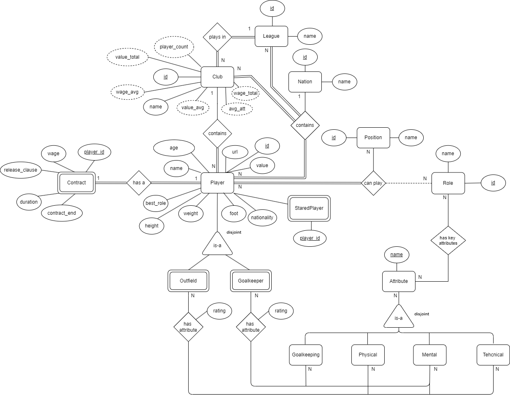
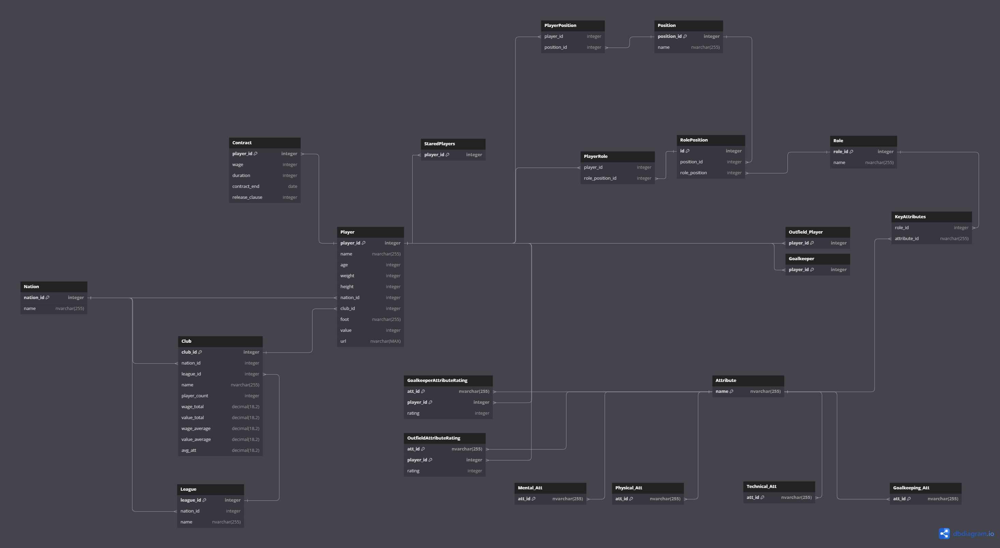

# BD: Trabalho Prático APF-T

**Grupo**: P5G5

- João Roldão, MEC: 113920
- Guilherme Rosa, MEC: 113968

## Introdução / Introduction

O ScoreSavant foi deselvolvido com o objetivo de pesquisar e analisar de forma aprofundada atributos de jogadores de futebol. Para tal, como base para este projeto foi utilizada a base de dados do jogos Football Manager.
O Football Manager é um jogo de simulação de futebol que permite ao jogador ser o treinador de uma equipa de futebol. O jogo é conhecido por ter uma base de dados muito extensa e detalhada, com informações sobre jogadores, equipas, competições, entre outros.
Para o nosso projeto final decidimo-nos focar principalmente na informação dos jogadores e dos seus atributos e como isso pode influenciar o papel que o jogador é mais adequado a desempenhar dentro de campo.

A nossa intenção com este projeto foi criar uma base de dados que permitisse ao utilizador pesquisar e analisar jogadores desta forma sem precisar do jogo, ou como um apoio para jogar o mesmo. Com esta base de dados o utilizador pode pesquisar jogadores por nome, nacionalidade, idade, clube, posição, entre outros atributos.

Como trabalho futuro gostaríamos de adicionar mais funcionalidades à base de dados como uma pesquisa mais avançada, tendo mais em conta os atributos dos jogadores, e adicionar mais tabelas com informação sobre equipas, competições, treinadores, entre outros.

## ​Análise de Requisitos / Requirements

### Requisitos Funcionais:

- Cadastro de Jogadores:
  - Inserir novos jogadores na base de dados.
  - Associar jogadores a clubes, ligas, países e contratos.
- Consulta de Jogadores:
  - Pesquisar jogadores por diferentes atributos (nome, nacionalidade, idade, clube, posição, etc.).
  - Paginação dos resultados de pesquisa.
- Consulta de Clubes e Ligas:
  - Obter informações detalhadas sobre clubes e ligas, incluindo o número de jogadores, média de salários e valor de mercado.
- Gestão de Atributos:
  - Calcular ratings de 'role' do jogador de acordo com os atributos e posições dele mesmo.
- Funcionalidades Adicionais:
  - Marcar jogadores como favoritos.
  - Obter jogadores aleatórios.
  - Implementar triggers para manter consistência nos dados (e.g., atualizar informações de clubes após a inserção de jogadores).

## Entidades / Entities

- Um **Player** tem vários atributos, como id, nome, peso, altura e outros atributos 'biológicos'. Para além destes temos o valor de mercado do jogador, e a sua 'role' preferida. Um **Player** pode ser um **Outfield Player** ou um **Goalkeeper**.
- Um **Player** pode estar vinculado a um **Contract** que tem informação como o salário, duração do contrato, e cláusula de rescisão. Para além disso um **Player** joga num **Club**.
- Um **Club** tem vários atributos, como id, nome, e vários outros atributos que são calculados a partir dos jogadores que o clube tem, como a quantidade de jogadores, a média de salário e valor de mercado dos jogadores e o total desses dois atributos também.
- Um **Club** pretence a uma **League**. Uma **League** tem como atributos o id e o nome da liga. Tanto o **Player**, como o **Club** e a **League** estão associados a um **Country**. Um **Country** tem como atributos o id e o nome do país.
- Todos os **Player** jogam noma **Position**. Uma **Position** tem várias **Role** associadas e uma **Role** pode ser associada a várias **Position**. Tanto a **Position** como a **Role** têm como atributos id e nome.
- Uma **Role** tem associada a si também vários **Key Attributes**, estes que são utilizados para calcular um 'rating' para um jogador de acordo com a sua **Position** e valores dos seus atributos.
- Um **Attribute** tem como atributo o nome. Existem 4 tipos de **Attribute**, os **Technical**, **Mental**, **Physical** e **Goalkeeper**.
- Cada **Player**, dependendo se é um **Outfield Player** ou um **Goalkeeper**, vai ter associado a si 3 destes tipos de **Attribute**.
- Um **Outfield Player** tem associado a si os **Technical**, **Mental** e **Physical** e um **Goalkeeper** tem associado a si os **Goalkeeper**, **Mental** e **Physical**.

## DER - Diagrama Entidade Relacionamento/Entity Relationship Diagram

### Versão final/Final version



### APFE

Em relação à primeira entrega adicionamos mais atributos ao clube, especialmente atributos que são calculados a partir dos jogadores que o clube tem.
Retiramos também o atributo "rating" relacionado com a avaliação do jogador de acordo com o papel que está a desempenhar em campo e os seus atributos. Em vez de ter isso na nossa base de dados decidimos que seria melhor realizar esse calculo no servidor já que a forma para calcular este "rating" poderia ser alterada no futuro o que implicava um recálculo da base de dados inteira.
A idade do jogador deixou de ser um atributo calculado.
Adicionamos também à tabela Nation o atributo id.
Decidimos adicionar a tabela StaredPlayer que permite guardar os jogadores como favoritos.

## ER - Esquema Relacional/Relational Schema

### Versão final/Final Version



### APFE

A principal mudança efetuada no ER foi a retirar a ligação entre a tabela OutfieldAttributeRating e as respetivas tabelas dos attributos específicos de um Outfield Player (atributos técnicos, mentais e físicos). Fizemos a mesma coisa com a tabela GoalkeeperAttributeRating em que retira-mos a ligação com a tabela dos atributos específicos de um Goalkeeper (atributos de guarda-redes, mentais e físicos). Isto foi feito porque da maneira anterior a base de dados não estava a funcionar como pretendido.
A solução foi ligar diretamente essas tabelas (OutfieldAttributeRating e GoalkeeperAttributeRating) com a tabela Attribute e a maneira de verificar que a distribuição de atributos para cada tipo de Player estava correta foi utilizando views e comparando nas stored procedures usadas para a inserção de um jogador.
Adicionamos também uma tabela que premite guardar os jogares como favoritos, a tabela StaredPlayer.

## ​SQL DDL - Data Definition Language

[SQL DDL File](sql/ScoreSavant_ddl.sql "SQLFileQuestion")

## SQL DML - Data Manipulation Language

Como vamos poder ver nos exemplos de Stored Procedures, Triggers e User Defined Functions, a manipulação de dados é feita através de SQL DML.

### Stored Procedures

#### addPlayer

Esta Stored Procedure é a nossa Query mais complexa. Ela é responsável por adicionar um jogador à base de dados.

```sql
CREATE PROCEDURE dbo.AddPlayer
    @name NVARCHAR(255),
    @age INT,
    @weight INT,
    @height INT,
    @nation NVARCHAR(255),
    @nation_league_id INT,
    @league NVARCHAR(255),
    @club NVARCHAR(255),
    @foot NVARCHAR(255),
    @value INT,
    @position NVARCHAR(255),
    @role NVARCHAR(255),
    @wage DECIMAL(18,2),
    @contract_end DATE,
    @release_clause INT,
    @attributes NVARCHAR(MAX),
    @url NVARCHAR(MAX)
AS
BEGIN
    SET NOCOUNT ON;

    DECLARE @nation_id INT;
    DECLARE @league_id INT;
    DECLARE @club_id INT;
    DECLARE @player_id INT;
    DECLARE @position_id INT;
    DECLARE @role_id INT;
    DECLARE @player_type INT;

    -- Add or get Nation
    EXEC dbo.AddNation @nation = @nation;
    SELECT @nation_id = nation_id FROM Nation WHERE name = @nation;

    -- Add or get League
    EXEC dbo.AddLeague @league = @league, @nation = @nation_league_id;
    SELECT @league_id = league_id FROM League WHERE name = @league;

    -- Add or get Club
    EXEC dbo.AddClub @club = @club, @nation_id = @nation_league_id, @league_id = @league_id;
    SELECT @club_id = club_id FROM Club WHERE name = @club;

    -- Validate Position (UDF)
    SET @position_id = dbo.ValidatePosition(@position);
    IF @position_id IS NULL
    BEGIN
        RAISERROR('Position not found: %s', 16, 1, @position);
        RETURN;
    END

    -- Determine player type based on position
    IF @position = 'GK'
    BEGIN
        SET @player_type = 1;
    END
    ELSE
    BEGIN
        SET @player_type = 0;
    END

    -- Validate Role (UDF)
    SET @role_id = dbo.ValidateRole(@role);
    IF @role_id IS NULL
    BEGIN
        RAISERROR('Role not found: %s', 16, 1, @role);
        RETURN;
    END

    -- Add Base Player
    EXEC dbo.AddBasePlayer @name = @name, @age = @age, @weight = @weight, @height = @height,
                           @nation_id = @nation_id, @club_id = @club_id, @foot = @foot,
                           @value = @value, @player_type = @player_type, @url = @url;
    SELECT @player_id = player_id FROM Player WHERE name = @name;

    -- Add Contract
    EXEC dbo.AddContract @player_id = @player_id, @wage = @wage, @contract_end = @contract_end, @release_clause = @release_clause;

    -- Add Player Position
    EXEC dbo.AddPlayerPosition @position = @position_id, @player = @player_id;

    -- Add Player Role
    EXEC dbo.AddPlayerRole @role = @role_id, @player = @player_id;

    -- Add Player Attributes and Ratings
    IF @player_type = 0 -- Outfield Player
    BEGIN
        EXEC dbo.AddOutfieldAttributeRating @PlayerID = @player_id, @Attributes = @attributes;
    END
    ELSE -- Goalkeeper
    BEGIN
        EXEC dbo.AddGoalkeeperAttributeRating @PlayerID = @player_id, @Attributes = @attributes;
    END
END
GO
```

Como podemos ver, esta Stored Procedure utiliza nela outras Stored Procedures e User Defined Functions para adicionar um jogador à base de dados. A ordem de inserção de dados na base de dados é algo que também é respeitado para que não haja erros devido a Foreign Keys.

#### addOutfieldAttributeRating

Esta é similar à Stored Procedure 'addGoalkeeperAttributeRating' e é outra das mais complexas. Ela é outra que é utilizada na Stored Procedure 'addPlayer' e é responsável por adicionar os atributos de um Outfield Player à base de dados.

```sql
CREATE PROCEDURE dbo.AddOutfieldAttributeRating
(
    @PlayerID INT,
    @Attributes NVARCHAR(MAX)
)
AS
BEGIN
    SET NOCOUNT ON;
    BEGIN TRY
        BEGIN TRANSACTION;

        -- Verify and return attributes
        DECLARE @VerifiedAttributes TABLE (Attribute NVARCHAR(255), Rating INT)
        INSERT INTO @VerifiedAttributes
        SELECT Attribute, Rating
        FROM dbo.VerifyAndReturnAttributes(@Attributes) -- UDF

        -- Debugging: Print contents of @VerifiedAttributes
        PRINT 'Verified Attributes:'
        SELECT * FROM @VerifiedAttributes

        -- Ensure attributes exist in at least one of the attribute tables before inserting
        IF EXISTS (
            SELECT 1
            FROM @VerifiedAttributes AS VA
            WHERE NOT EXISTS (SELECT 1 FROM Technical_Att WHERE att_id = VA.Attribute)
              AND NOT EXISTS (SELECT 1 FROM Mental_Att WHERE att_id = VA.Attribute)
              AND NOT EXISTS (SELECT 1 FROM Physical_Att WHERE att_id = VA.Attribute)
        )
        BEGIN
            PRINT 'One or more attributes do not exist in the attribute tables.'
            ROLLBACK TRANSACTION;
            THROW 50002, 'One or more attributes do not exist in the attribute tables.', 1;
        END

        -- Insert into OutfieldAttributeRating
        INSERT INTO OutfieldAttributeRating (att_id, player_id, rating)
        SELECT Attribute, @PlayerID, Rating
        FROM @VerifiedAttributes

        -- Verify all attributes from Technical_Att, Mental_Att, and Physical_Att are present
        DECLARE @MissingTechnicalAtt TABLE (att_id NVARCHAR(255))
        DECLARE @MissingMentalAtt TABLE (att_id NVARCHAR(255))
        DECLARE @MissingPhysicalAtt TABLE (att_id NVARCHAR(255))

        -- Find missing technical attributes
        INSERT INTO @MissingTechnicalAtt
        SELECT att_id
        FROM Technical_Att
        WHERE att_id NOT IN (SELECT Attribute FROM @VerifiedAttributes)

        -- Find missing mental attributes
        INSERT INTO @MissingMentalAtt
        SELECT att_id
        FROM Mental_Att
        WHERE att_id NOT IN (SELECT Attribute FROM @VerifiedAttributes)

        -- Find missing physical attributes
        INSERT INTO @MissingPhysicalAtt
        SELECT att_id
        FROM Physical_Att
        WHERE att_id NOT IN (SELECT Attribute FROM @VerifiedAttributes)

        -- Print the contents of the missing attribute tables
        PRINT 'Missing Technical Attributes:'
        SELECT * FROM @MissingTechnicalAtt

        PRINT 'Missing Mental Attributes:'
        SELECT * FROM @MissingMentalAtt

        PRINT 'Missing Physical Attributes:'
        SELECT * FROM @MissingPhysicalAtt

        -- Check if any attributes are missing
        IF (SELECT COUNT(*) FROM @MissingTechnicalAtt) > 0
           OR (SELECT COUNT(*) FROM @MissingMentalAtt) > 0
           OR (SELECT COUNT(*) FROM @MissingPhysicalAtt) > 0
        BEGIN
            -- Display missing attributes
            SELECT 'Missing Technical Attributes' AS AttributeType, att_id AS MissingAttribute FROM @MissingTechnicalAtt
            UNION ALL
            SELECT 'Missing Mental Attributes' AS AttributeType, att_id AS MissingAttribute FROM @MissingMentalAtt
            UNION ALL
            SELECT 'Missing Physical Attributes' AS AttributeType, att_id AS MissingAttribute FROM @MissingPhysicalAtt

            ROLLBACK TRANSACTION;
            THROW 50003, 'Not all required attributes were inserted.', 1;
        END

        COMMIT TRANSACTION;
    END TRY
    BEGIN CATCH
        IF @@TRANCOUNT > 0
            ROLLBACK TRANSACTION;
        THROW;
    END CATCH
END
GO
```

Todas as restantes Stored Procedures presentes na ST 'addPlayer' e outras utilizadas para a tabela de StaredPlayers estão no ficheiro: [Stored Procedures](sql/Stored_Procedures.sql "SQLFileQuestion").

### User Defined Functions

#### getPlayersWithPagination

Este é um exemplo de uma User Defined Function utilizada para fazer uma pesquisa com paginação. Existem outras UDFs que fazem o mesmo para outras tabelas.

```sql
CREATE FUNCTION dbo.GetPlayersWithPagination
(
    @PageNumber INT,
    @PageSize INT,
    @OrderBy NVARCHAR(50) = NULL,
    @OrderDirection NVARCHAR(4) = NULL,
    @SearchPlayerName NVARCHAR(255) = NULL,
    @SearchClubName NVARCHAR(255) = NULL,
    @SearchPositionName NVARCHAR(255) = NULL,
    @SearchNationName NVARCHAR(255) = NULL,
    @SearchLeagueName NVARCHAR(255) = NULL,
    @MinWage DECIMAL(18,2) = NULL,
    @MaxWage DECIMAL(18,2) = NULL,
    @MinValue DECIMAL(18,2) = NULL,
    @MaxValue DECIMAL(18,2) = NULL,
    @MinAge INT = NULL,
    @MaxAge INT = NULL,
    @MinReleaseClause DECIMAL(18,2) = NULL,
    @MaxReleaseClause DECIMAL(18,2) = NULL
)
RETURNS TABLE
AS
RETURN
(
    SELECT
        PlayerID,
        PlayerName,
        Position,
        Club,
        Wage,
        Value,
        Nation,
        League,
        Age,
        ReleaseClause
    FROM
    (
        SELECT
            p.player_id AS PlayerID,
            p.name AS PlayerName,
            pos.name AS Position,
            cl.name AS Club,
            c.wage AS Wage,
            p.value AS Value,
            n.name AS Nation,
            l.name AS League,
            p.age AS Age,
            c.release_clause AS ReleaseClause,
            ROW_NUMBER() OVER (
                ORDER BY
                    CASE WHEN @OrderBy = 'PlayerName' AND @OrderDirection = 'ASC' THEN p.name END ASC,
                    CASE WHEN @OrderBy = 'PlayerName' AND @OrderDirection = 'DESC' THEN p.name END DESC,
                    CASE WHEN @OrderBy = 'Age' AND @OrderDirection = 'ASC' THEN p.age END ASC,
                    CASE WHEN @OrderBy = 'Age' AND @OrderDirection = 'DESC' THEN p.age END DESC,
                    CASE WHEN @OrderBy = 'Position' AND @OrderDirection = 'ASC' THEN pos.name END ASC,
                    CASE WHEN @OrderBy = 'Position' AND @OrderDirection = 'DESC' THEN pos.name END DESC,
                    CASE WHEN @OrderBy = 'Club' AND @OrderDirection = 'ASC' THEN cl.name END ASC,
                    CASE WHEN @OrderBy = 'Club' AND @OrderDirection = 'DESC' THEN cl.name END DESC,
                    CASE WHEN @OrderBy = 'Wage' AND @OrderDirection = 'ASC' THEN c.wage END ASC,
                    CASE WHEN @OrderBy = 'Wage' AND @OrderDirection = 'DESC' THEN c.wage END DESC,
                    CASE WHEN @OrderBy = 'Value' AND @OrderDirection = 'ASC' THEN p.value END ASC,
                    CASE WHEN @OrderBy = 'Value' AND @OrderDirection = 'DESC' THEN p.value END DESC,
                    CASE WHEN @OrderBy = 'Nation' AND @OrderDirection = 'ASC' THEN n.name END ASC,
                    CASE WHEN @OrderBy = 'Nation' AND @OrderDirection = 'DESC' THEN n.name END DESC,
                    CASE WHEN @OrderBy = 'League' AND @OrderDirection = 'ASC' THEN l.name END ASC,
                    CASE WHEN @OrderBy = 'League' AND @OrderDirection = 'DESC' THEN l.name END DESC,
                    -- Default order
                    p.player_id
            ) AS RowNum
        FROM
            Player p
        INNER JOIN
            PlayerPosition playpos ON playpos.player_id = p.player_id
        INNER JOIN
            Position pos ON pos.position_id = playpos.position_id
        INNER JOIN
            Club cl ON p.club_id = cl.club_id
        INNER JOIN
            Contract c ON p.player_id = c.player_id
        INNER JOIN
            Nation n ON p.nation_id = n.nation_id
        INNER JOIN
            League l ON cl.league_id = l.league_id
        WHERE
            (@SearchPlayerName IS NULL OR p.name LIKE '%' + @SearchPlayerName + '%')
            AND (@SearchClubName IS NULL OR cl.name LIKE '%' + @SearchClubName + '%')
            AND (@SearchPositionName IS NULL OR pos.name LIKE '%' + @SearchPositionName + '%')
            AND (@SearchNationName IS NULL OR n.name LIKE '%' + @SearchNationName + '%')
            AND (@SearchLeagueName IS NULL OR l.name LIKE '%' + @SearchLeagueName + '%')
            AND (@MinWage IS NULL OR c.wage >= @MinWage)
            AND (@MaxWage IS NULL OR c.wage <= @MaxWage)
            AND (@MinValue IS NULL OR p.value >= @MinValue)
            AND (@MaxValue IS NULL OR p.value <= @MaxValue)
            AND (@MinAge IS NULL OR p.age >= @MinAge)
            AND (@MaxAge IS NULL OR p.age <= @MaxAge)
            AND (@MinReleaseClause IS NULL OR c.release_clause >= @MinReleaseClause)
            AND (@MaxReleaseClause IS NULL OR c.release_clause <= @MaxReleaseClause)
    ) AS PlayersWithRowNum
    WHERE
        RowNum > (@PageNumber - 1) * @PageSize
        AND RowNum <= @PageNumber * @PageSize
)
GO
```

#### getPlayerAttributes

Esta UDF é utilizada para obter os atributos de um jogador.

```sql
CREATE FUNCTION dbo.GetPlayerAttributes(
    @player_id INT
)
RETURNS @PlayerAttributes TABLE (
    att_id INT,
    rating INT
)
AS
BEGIN
    -- Insert into the return table from OutfieldAttributeRating
    INSERT INTO @PlayerAttributes (att_id, rating)
    SELECT
        our.att_id,
        our.rating
    FROM OutfieldAttributeRating our
    INNER JOIN Attribute attributes ON
        attributes.name = our.att_id
    WHERE our.player_id = @player_id;

    -- If the OutfieldAttributeRating selection is null, insert from GoalkeeperAttributeRating
    IF NOT EXISTS (SELECT 1 FROM @PlayerAttributes)
    BEGIN
        INSERT INTO @PlayerAttributes (att_id, rating)
        SELECT
            gar.att_id,
            gar.rating
        FROM GoalkeeperAttributeRating gar
        INNER JOIN Attribute attributes ON
            attributes.name = gar.att_id
        WHERE gar.player_id = @player_id;
    END

    RETURN;
END
GO
```

#### getLeagueByID

Esta UDF é utilizada para obter informação sobre uma liga através do seu ID.

```sql
CREATE FUNCTION dbo.getLeagueById
(
    @LeagueID INT
)
RETURNS TABLE
AS
RETURN
(
    SELECT
        l.league_id,
        l.name AS league_name,
        n.name AS nation_name,
        COUNT(DISTINCT c.club_id) AS total_clubs,
        COUNT(DISTINCT p.player_id) AS total_players,
        SUM(c.value_total) AS total_value,
        SUM(c.wage_total) AS total_wage,
        AVG(c.avg_att) AS avg_att
    FROM
        League l
        INNER JOIN Club c ON l.league_id = c.league_id
        INNER JOIN Player p ON c.club_id = p.club_id
        INNER JOIN Nation n ON l.nation_id = n.nation_id
    WHERE
        l.league_id = @LeagueID
    GROUP BY
        l.league_id,
        l.name,
        n.name
)
GO
```

Todas as restantes User Defined Functions presentes no ficheiro: [User Defined Functions](sql/User_Defined_Functions.sql "SQLFileQuestion").

### Triggers

#### trg_after_insert_player

Este é o Trigger que é executado após a inserção de um jogador na base de dados. Ele é responsável por calcular a média de salário e valor de mercado dos jogadores de um clube e atualizar esses valores na tabela Club.

```sql
CREATE TRIGGER trg_after_insert_players
ON Player
AFTER INSERT
AS
BEGIN
    DECLARE @club_id INT;
    DECLARE @total_players INT;
    DECLARE @total_wage DECIMAL(18, 2);
    DECLARE @total_value DECIMAL(18, 2);
    DECLARE @avg_att DECIMAL(18, 2);

    -- Get the club_id from the inserted row
    SELECT @club_id = club_id
    FROM INSERTED;

    -- Calculate the new totals
    SELECT @total_players = COUNT(*),
           @total_wage = SUM(PC.wage),
           @total_value = SUM(P.value)
    FROM Player P
    JOIN PlayerContract PC ON P.player_id = PC.player_id
    WHERE P.club_id = @club_id;

    -- Calculate the average attribute rating combining outfield and goalkeeper ratings
    SELECT @avg_att = AVG(CASE
                            WHEN oa.rating IS NOT NULL THEN oa.rating
                            ELSE ga.rating
                          END)
    FROM Player P
    LEFT JOIN OutfieldAttributeRating oa ON P.player_id = oa.player_id
    LEFT JOIN GoalkeeperAttributeRating ga ON P.player_id = ga.player_id
    WHERE P.club_id = @club_id;

    -- Handle case where there are no players
    IF @total_players = 0
    BEGIN
        SET @total_wage = 0;
        SET @total_value = 0;
        SET @avg_att = 0;
    END

    -- Update Club table
    UPDATE Club
    SET player_count = @total_players,
        wage_total = @total_wage,
        value_total = @total_value,
        wage_average = CASE WHEN @total_players > 0 THEN @total_wage / @total_players ELSE 0 END,
        value_average = CASE WHEN @total_players > 0 THEN @total_value / @total_players ELSE 0 END,
        avg_att = @avg_att
    WHERE club_id = @club_id;
END;
GO
```

#### trg_after_delete_nation

Os nossos Triggers de delete foram implementados para funcionar de forma 'cascade'. Este Trigger é executado em vez da eliminação de uma nação e é responsável por eliminar todos os jogadores dessa nacionalidade, depois os clubes, que por sua vez eleminam os seus jogadores, após isso as ligas e por fim o país.

```sql
CREATE TRIGGER trg_after_delete_nation
ON Nation
AFTER DELETE
AS
BEGIN
    -- Declare variables
    DECLARE @nation_id INT;

    -- Loop through each deleted nation
    DECLARE deleted_nation_cursor CURSOR FOR
    SELECT nation_id FROM DELETED;

    OPEN deleted_nation_cursor;

    FETCH NEXT FROM deleted_nation_cursor INTO @nation_id;

    WHILE @@FETCH_STATUS = 0
    BEGIN
        -- Delete players of the nation
        DELETE FROM Player WHERE nation_id = @nation_id;

        -- Delete the clubs of the nation
        DELETE FROM Club WHERE nation_id = @nation_id;

        -- Delete the leagues of the nation
        DELETE FROM League WHERE nation_id = @nation_id;

        -- Delete the nation
        DELETE FROM Nation WHERE nation_id = @nation_id;

        FETCH NEXT FROM deleted_nation_cursor INTO @nation_id;
    END

    CLOSE deleted_nation_cursor;
    DEALLOCATE deleted_nation_cursor;
END;
GO
```

Os outros Triggers de delete são semelhantes a este, mas para as outras tabelas.

Todas as restantes Triggers presentes no ficheiro: [Triggers](sql/Triggers.sql "SQLFileQuestion").

### Views

#### randomPlayer

Esta View é utilizada para obter um jogador aleatório da base de dados.

```sql
CREATE VIEW RandomPlayer AS
SELECT TOP 1
    p.player_id,
    p.name AS player_name,
    p.nation_id,
    n.name AS nation_name,
    p.club_id,
    c.name AS club_name,
    p.url AS player_url
FROM
    Player p
JOIN
    Nation n ON p.nation_id = n.nation_id
JOIN
    Club c ON p.club_id = c.club_id
ORDER BY
    NEWID();
GO
```

#### getPhysicalAttributes

Esta View é utilizada para obter os atributos físicos, há outras views para os outros tipos de atributos.

```sql
CREATE VIEW [dbo].[GetPhysicalAtt]
AS
SELECT
    pa.att_id AS AttributeID
FROM
    Physical_Att pa
GO
```

Todas as restantes Views presentes no ficheiro: [Views](sql/Views.sql "SQLFileQuestion").

## Normalização/Normalization

Para a normalização da base de dados, seguimos as regras de normalização até à 3ª forma normal.
A nossa entrega inicial já estava normalizada até à 3ª forma normal, e não houve necessidade de fazer alterações na base de dados que alterassem a normalização da mesma.

Apesar de haver relações N para N na nossa base de dados, estas foram resolvidas com a criação de tabelas intermédias, como por exemplo a tabela PlayerPosition, PlayerRole, RolePosition, KeyAttributeRole, entre outras. A normalização destas tabelas foi feita de forma a que não houvesse redundância de dados e que a informação estivesse organizada de forma a que fosse fácil de aceder e de manipular.

## SQL Programming: Stored Procedures, Triggers, UDF

[SQL Stored Procedures](sql/Stored_Procedures.sql "SQLFileQuestion")

[SQL User Defined Functions](sql/User_Defined_Functions.sql "SQLFileQuestion")

[SQL Triggers](sql/Triggers.sql "SQLFileQuestion")

[SQL Views](sql/Views.sql "SQLFileQuestion")

## Outras notas/Other notes

### Dados iniciais da dabase de dados/Database init data

Como o projeto foi baseado no jogo FootballManager decidimos utilizar os dados reais presentes no jogo.
Para conseguir isto desenvolvemos um [script]() em python para extrair estes dados do website [fmsinde](https://fminside.net/players/) e inserir diretamente na base de dados.

### Apresentação

[Slides](ScoreSavant_Presentation.pdf "Sildes")

[Video](ScoreSavant_Demo_Version1.mp4)
